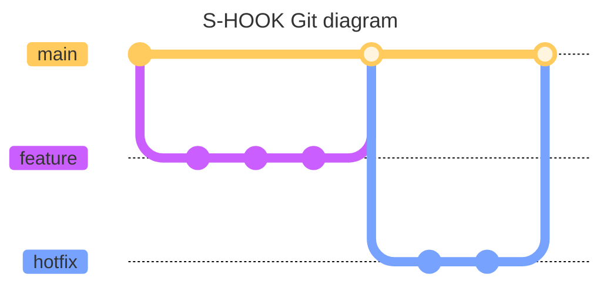
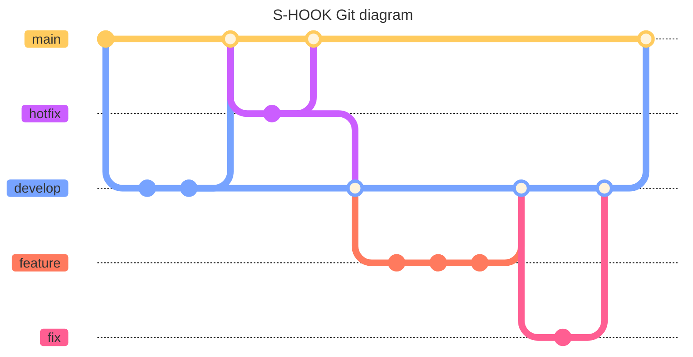

## Git Branch 전략 재확립

- Git Flow 에서 Github Flow로 변경하였다.
- 이전 Branch 전략

![[current-shook-git-branch-strategy.png]]

- 현재 Branch 전략

![[prev-shook-git-branch-strategy.png]]

- 전략 재확립 이유
	- 현재 프로젝트 상황에서는 단순한 Github Flow가 관리가 더 용이하다.
	- 모든 개발 내용이 main으로 중심으로 이루어져서, develop, main의 싱크를 신경쓰지 않아도 된다.
	- 웹 서비스이므로 버전을 관리할 필요가 없다고 판단했다.
	- 브랜치가 파생될 수 있는 곳이 main 밖에 없어 충돌 가능성이 적다.

## 3차 데모데이에 구현할 기능

- 로그인
	- 소셜 로그인
	- 그냥 로그인
	- 암호화
		- jwt
		- session
- 유저들이 투표한 킬링파트를 볼 수 있다.
- 유저들이 투표한 TOP 3 킬링파트를 볼 수 있다.
- 킬링파트를 많이 알아본 순(?)으로 음잘알 배지를 제공한다.
- 지정된 파트의 영상을 재생할 수 있다.
- 파트 투표할 시 댓글도 함께 쓸 수 있도록 한다. (베로 개인 의견)
- 등록한 파트를 공감하는 비율이 노래의 총 파트 투표 중에 몇 퍼센트인지 알려준다.
- 등록하기 전에는 파트 순위를 볼 수 없고, 등록 후에 파트 순위를 볼 수 있다.
- 파트 순위를 즉시 확인하는 기능 -> 대신 음잘알 배지나 순위에는 반영되지 않도록 한다. (베로 개인 의견)

## 피드백

### 코치 피드백

#### S-HOOK

- 기능에 집중하고, 기술에 집중하지 않는 것이 좋다.
- 로그인 하지마
	- mock 유저를 사용해서 기능을 구현하자. 굳이 소셜이냐 뭐냐 고민 안 해도 될 듯.
	- 고도화는 레벨 4에
- 애자일하게 진행하자. 애자일의 각 단위 때마다 의미가 있는 부분을 구현해야 한다.
- 투표라는 말에 혼선이 존재한다. (모달에서 보여주는 '투표' 라는 말을 빼자)
	- 우리끼리 투표라는 말을 사용했지만, 다음 스프린트 때는 없어질 수도 있다.
	- 스프린트마다 용어를 다시 정의하기도 한다. 그것이 애자일이다 by 브라운
- 사용자가 우리의 서비스를 사용할 때, 플로우를 공부(?) 해야 할 수도 있다. (사용 방식이 잘 와닿지 않는다는 것일지도)
- 핵심적인 기능을 먼저 만들어서 우리가 전달하고자 하는 가치를 진짜 전달할 수 있을지 없는지를 검증하고 세부적으로 진행하는 것이 좋다.
	- 일단 만들어보고 -> 세부 사항을 검증해라

#### 다른 팀

- 기능 우선순위를 두고 구현해야 한다.

### 개인 의견

- 서비스의 기능 플로우를 좀 더 명확하게 보여주자.
	- 해당 기능을 통해 어떤 것을 의도했는지도 적어주면 좋을 거 같다.
- 다음 데모데이 기능을 말할 때, 다음 데모데이의 중심 가치와 함께 발표하자.
	- 중심 가치가 우리 서비스의 어떤 가치를 충족할 수 있을지 함께 발표하자.
- 3차 데모데이에 전달하고 싶은 우리 서비스의 가치에 대해 싱크를 맞추자. (내가 대답 못함..)
- 질문 대답 같이 하는 거 좋은 듯
- 구현할 기능 옆에 어떤 것을 의도했는지 적으면 좋을 듯
- 로그인 했을 때 안 했을 때 나눠서 데모하는 것도 좋을 듯

### 나에 대한 피드백

- 답변할 때 생각 정리하고 말하기
- 답변하기 전에 할 말 적어두기
- 열린 자세로 의견을 수용하기
- 의견을 비난이라고 속단하지 않기

## 회고

이 글 올리면 다들 잘 안 볼 거 같으니 여기다가 2주차 데모데이 회고를 적는다.

### 함께하는 팀

팀은 하나다. 우리는 장난스럽게 하는 말이기도 하지만, 나는 이 말을 가장 잘 지키는 팀은 우리라고 생각한다.    
문제는 함께 해결하고, 고민은 함께 나눈다.    
찬성 의견이든 반대 의견이든 누구나 의견이 있다면 말할 수 있고, 함께 의논할 수 있다.     
내가 원했던 협업의 모습을 띠는 것 같아 뿌듯했다.    

이번 협업에서 내가 가장 중요하게 생각했던 것은 소통이다.    
다른 건 아니어도 좋으니, 편하게 의견을 낼 수 있는 팀이라면 좋겠다고 생각했다.     
우리 팀에서 만족하는 부분은 바로 의견 제시가 자유롭고, 반대 의견도 함께 의논하는 분위기라는 것이다.     

특히 내가 주류 의견이든, 반대 의견이든 의견을 많이 내는 편인데, 팀의 누구도 그런 쓸데 없는 고민을 왜 하느냐고 질책하지 않는다. 오히려 공감하고, 함께 고민해주어서 감사할 때가 많았다.

사실 너무나도 많이 말한 이야기인 것 같지만 ㅋㅋㅋ 페르소나를 다시 재정의해야 했던 시간이 있었다.

물론 모두가 반대 의견 내기를 즐기는(?) 것은 아니다.    
사람들의 특성 때문이기도 하고, 일정을 맞추지 못할까 봐 넘어가는 사람들도 있을 것이다. 나는 그런 이유로 넘어가는 것은     
그렇지만 반대 의견을 내는 것이 '상대방의 기분을 안 좋게 하기 때문에' 안 하는 사람들은 없어서 정말정말정말정말 다행이라고 생각한다. 더해서 반대 의견이 나왔다고 해서 기분이 안 좋아지는 팀원도 없어서 정말정말 다행이다.    

레벨3에서 다행히도 좋은 팀을 만난 것 같아 감사하고, 팀과 함께 하는 시간이 즐겁다.     

### 그리고 팀원들

나는 내 의견이 있고, 시간의 압박 속에서 반대 의견도 잘 말할 수 있지만 의견 중 하나를 택 일 하는 것이 어렵다. 내 의견에 큰 미련이 없어 내 의견이 채택되지 않아도 괜찮다.      
그래서 그런지 스플릿이 같은 파트라서 더 시너지가 난다고 생각한다.     
스플릿은 의견도 확고하고, 자신만의 근거가 있다. 그리고 어떤 의견 하나를 확실하게 정하는 것을 잘한다. 특히 백엔드에서 회의를 할 때, 제시된 대안들 모두 좋은 경우가 많다. 그 중에서 하나를 확실하게 골라준다. 그 덕분인지 의견 결정 과정에서 의견 결정이 미뤄지지 않아 데드라인을 맞추는 것이 어렵지 않았다.    

바론은 의견 정리를 잘한다. 여러 가지 의견이 나오다보면 의견이 섞이는 때가 많은데, 그럴 때마다 항상 의견 정리를 잘 해준다. 특히 나한테 도움되는 부분이라고 할 수 있다 ㅋㅋ 나는 의견이 섞이다 보면 무슨 이야기를 하고 있었는지, 어떤 거에 대해 의견을 내고 있었는지 까먹는데 바론이 의견 정리해줄 때마다 다시 회의 주제로 돌아갈 수 있다.    
룰에 대해서도 자주 리마인드를 해주어서 초기에 정했던 규칙을 그나마 많이 지킬 수 있었다.    다른 사람들도 회의하면 시간 생각 없이 계속 하다가 지치는 편인데 바론의 회의 시간 리마인드가 굉장히 도움이 되었다. 

아코는 의견을 자주 내는 편은 아니지만, 고민을 많이 한 뒤에 의견을 내기 때문에 도출된 의견이 중요한 관점의 의견일 때가 많다. 가끔 아코가 반대 의견을 낼 때도 있는데, 하나의 의견에 매몰되지 않고 다양한 관점으로 문제를 바라볼 수 있는 시각을 제공해줘서 많은 도움이 되었다.

우코는 이해력이 빠르다. 나는 내 의견을 말로 정리하기 힘들어서 일단 떠오르는 생각들을 말로 내뱉고 다른 사람들이 이해하기를 바라는 편인데 그럴 때마다 한 번에 이해해줘서 정말 고마울 때가 많다...ㅋㅋㅋ 특히 팀원의 주류와 다른 의견이 나왔을 때, 반대 의견에도 지속적으로 의견을 물어봐주어서 팀 내에서 소수의 의견이 묻히는 일이 없다!     

코난은 다른 사람의 의견에 근거를 더해주는 역할을 잘한다. 다른 사람들이 의견을 냈을 때 어떤 부분에서 그 의견이 좋다고 느꼈는지, 이런 부분에서도 좋을 것이라 생각한다는 의견을 덧붙여준다. 
프론트엔드의 든든한 기둥이다. 집중력이 좋고, 작업 속도도 빨라서 어떤 기능이든 뚝딱 만들어낸다. 이번에 youtube iframe 도 금방 학습하고, 기능을 응용해서 우리 서비스에 맞는 기능을 빠르게 만들어주었다. 

도밥은 우리가 기획한 내용들이 실제 서비스에 어떻게 반영되어야 할 지 리마인드해준다. 이런 방향으로 페이지를 보여줄 수 있다, 이런 과정을 통해 기능을 제공할 수 있겠다는 말을 해주어서 서비스를 확실하게 구상할 수 있다. 특히 기획이 마무리 되고 대략적인 서비스 플로우를 생각할 때 도밥의 능력이 더 빛을 발한다.     
하나의 목표가 정해지면, 정해진 목표에 완전히 몰입한다. 우리 팀 중에서 개발에 가장 시간을 많이 쏟는 팀원이라고 생각한다. 

### Emotion Meeting

리사가 웃겨했던 우리 팀 감정회고 시간...ㅋㅋㅋ
우리 팀은 금요일마다 저녁을 함께 먹는다. 데모데이 저녁에는 함께 회식을 하는 시간을 갖는다.     
보통 캠퍼스로 음식을 배달시켜 먹는 편인데, 사실 밥 먹을 때는 그냥 우스갯소리하거나 조용히 밥을 먹는다 ㅋㅋㅋ 저녁밥을 어느정도 다 먹으면 Emotion Meeting이 시작된다.    

보통 시작은 아코로 시작한다. 아코로 시작해서 하고 싶은 말이 있는 팀원들 순으로 말한다. 

to be continue... 시간 되면 써야지