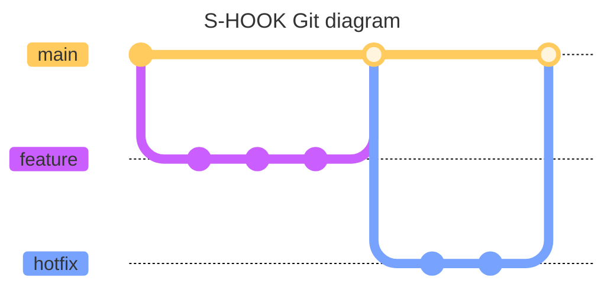
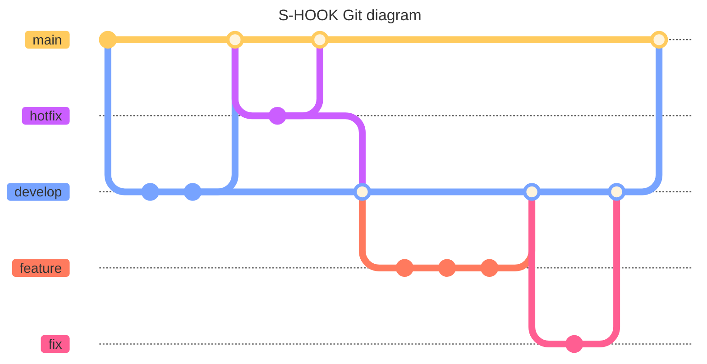

## Git Branch 전략 재확립

- Git Flow 에서 Github Flow로 변경하였다.
- 이전 Branch 전략

![[current-shook-git-branch-strategy.png]]

- 현재 Branch 전략

![[prev-shook-git-branch-strategy.png]]

- 전략 재확립 이유
	- 현재 프로젝트 상황에서는 단순한 Github Flow가 관리가 더 용이하다.
	- 모든 개발 내용이 main으로 중심으로 이루어져서, develop, main의 싱크를 신경쓰지 않아도 된다.
	- 웹 서비스이므로 버전을 관리할 필요가 없다고 판단했다.
	- 브랜치가 파생될 수 있는 곳이 main 밖에 없어 충돌 가능성이 적다.