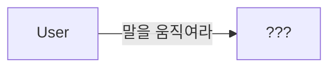
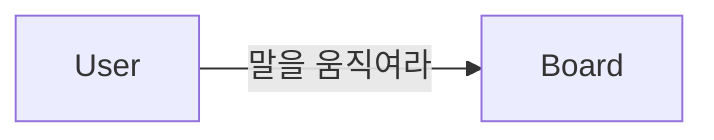
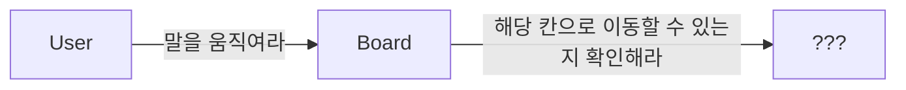
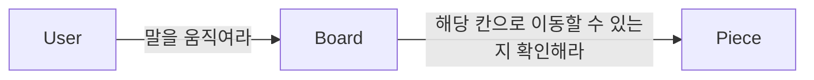
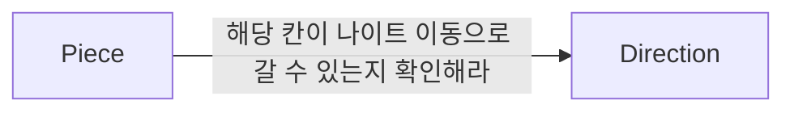
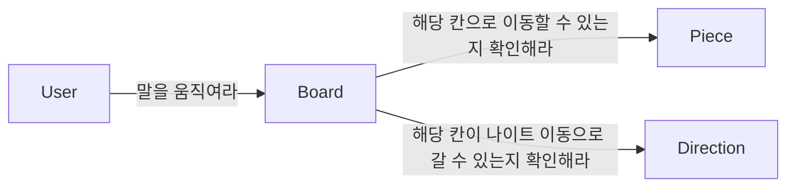
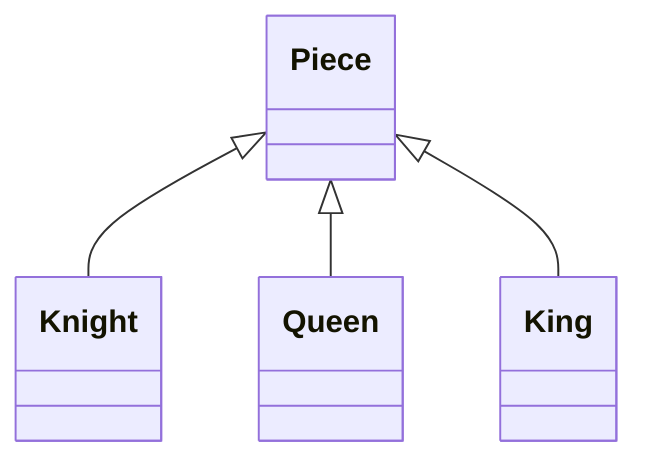

## GRASP

**G**eneral **R**esponsibility **A**ssignment **S**oftware **P**atterns 의 약자로, 일반적인 책임 할당을 위한 소프트웨어 패턴이다.

모든 예제는 체스 미션을 예시로 들 예정이다.

### Information Expert Pattern (정보 전문가 패턴)

**정보 전문가에게 책임을 할당하라.**
객체에게 책임을 할당할 때는 책임을 수행할 정보를 알고 있는 객체에게 책임을 할당해야 한다.

체스 미션의 Board와 Board를 구성하는 Square와 Piece를 생각해보자.

사용자로부터 move a2 a4 라는 입력을 받은 경우, a2에 있는 말을 a4로 움직여야 한다.
그렇다면 이 메시지를 수신할 적합한 객체는 무엇일까?

객체는 상태와 행동을 통합한 캡슐화의 단위이다.
따라서, 객체에게 책임을 할당하는 첫 번째 원칙은 책임을 수행할 정보를 알고 있는 객체에게 책임을 할당하는 것이다.

아마 Board라는 객체가 말을 움직이는 것이 적합해보인다.
Board는 말과 현재 턴을 알고 있다. 말을 움직이는 것을 위한 정보 전문가라고 할 수 있다.

그렇지만 a2에 있는 말이 a4에 갈 수 있는지는 Board가 알 수 없다. 이럴 때는 외부에 도움을 요청해야 한다.
외부 객체에게 요청해서 말이 움직일 칸으로 이동할 수 있는지를 알아내야 한다.

말이 움직일 칸으로 이동할 수 있는지 계산하는 데 필요한 정보를 알고 있는 전문가는 Piece이다. 
따라서 Information Expert 패턴에 따라 메시지를 수신할 적당한 객체는 Piece가 된다.

단, 정보 전문가가 데이터를 반드시 저장하고 있을 필요는 없다.
객체는 해당 정보를 제공할 수 있는 다른 객체를 알고 있거나, 필요한 정보를 계산해서 제공할 수도 있다.

Information Expert Pattern은 정보를 알고 있는 객체만이 책임을 어떻게 수행할지 스스로 결정할 수 있으므로 객체가 자율적인 존재가 되도록 돕는다. 필요한 정보를 가진 객체들로 책임이 분산되어 더 응집력 있고, 이해하기 쉬워진다. 따라서 응집도는 올라가고, 결합도가 낮아져서 간결하고 유지보수하기 쉬운 시스템을 구축할 수 있다.

### 높은 응집도와 낮은 결합도

이런 식의 설계가 되어 있을 때, Board가 Direction에게 직접 나이트 이동으로 갈 수 있는지 확인해도 되지 않을까?

즉, 다음과 같은 설계를 말한다.

기능적인 측면에서는 차이가 없는 것처럼 보인다. 
Direction이 Board와 협력하는 것이 좋을까, Piece와 협력하는 것이 좋을까?

#### Low Coupling (낮은 결합도)

**의존성을 낮추고 변화의 영향을 줄이며 재사용성을 증가시키도록 책임을 할당하라.**

첫 설계에서는 Board와 Piece가 이미 결합되어 있다.
이때 Piece와 Direction이 협력하게 하면 설계 전체적으로 결합도를 추가하지 않고도 협력을 완성할 수 있다.
Board와 Direction이 협력할 경우에는 새로운 결합도가 추가된다.

Low Coupling 패턴의 관점에서는 새로운 결합도를 추가하지 않는 방향으로 설계하는 것이 좋다.

#### High Cohesion (높은 응집도)

**복잡성을 관리할 수 있는 수준으로 유지하기 위해 높은 응집도를 유지하는 방향으로 책임을 할당하라.**

Board의 중요한 책임은 말을 움직이는 것이다. 이때, Direction과 협력하게 되면 거리 계산과 관련된 책임을 갖게 될 수 밖에 없다.
그렇다면 이후 말을 움직이는 방식이 변경되는 경우, Board도 같이 변경되어야 한다. 이런 경우 응집도가 낮아질 수 밖에 없다.

그러나 Piece의 주된 책임은 해당 칸으로 이동할 수 있는지에 대한 것이다.
따라서 필요한 조건을 확인하기 위해 Direction과 협력하는 것은 응집도에 해를 끼치지 않는다.

High Cohesion 패턴 관점에서는 객체들이 서로 관련되도록 설계하는 것이 좋다.

### Creator Pattern (창조자 패턴)

**협력에 참여하는 어떤 객체에게는 인스턴스를 생성할 책임이 있다.
다음 조건을 최대한 만족하는 객체에게는 객체 생성 책임을 할당하라.**

- B가 A 객체를 포함하거나 참조한다.
- B가 A 객체를 기록한다.
- B가 A 객체를 긴밀하게 사용한다.
- B가 A 객체를 초기화하는 데 필요한 데이터를 가지고 있다. (B가 A에 대한 정보 전문가이다.)

### Polymorphism (다형성)

**타입을 명시적으로 정의하고 각 타입에 다형적으로 행동하는 책임을 할당하라.**

Board 입장에서 생각했을 때, 말을 움직일 때 말이 어떤 말인지는 상관 없다. 어떤 말이든지 움직일 수 있어야 한다.
즉, Board가 구체적인 클래스는 알지 못하고 '말'이라는 역할에 대해서만 결합되도록 의존성을 제한할 수 있다.

Piece라는 클래스를 추상화하고, 해당 클래스를 상속하는 Knight, Queen, ... 등의 말을 추가한다.
Board는 각 말들 (Queen, Knight...) 의 구현이 바뀌거나 추가되어도 Piece의 추상화된 메서드로만 기능을 수행하기 때문에, 구체적인 타입을 몰라도 괜찮다.

객체의 타입에 따라 변하는 행동이 있다면 타입을 분리하고 변화하는 행동을 각 타입의 책임으로 할당한다. 이를 Polymorphism 패턴이라고 한다.

구현을 공유할 필요 없이 역할을 대체하는 객체들의 책임만 정의하고 싶다면 인터페이스를 사용한다.
역할을 대체할 클래스들 사이에서 구현을 공유해야 할 필요가 있다면 추상 클래스를 사용하면 된다.

### Protected Variations (변화에 대한 보호)

객체를 변경으로부터 분리하고, 추상화 타입을 통해 캡슐화한다.
**변화가 예상되는 불안정한 지점들을 식별하고 그 주위에 안정된 인터페이스를 형성하도록 책임을 할당하라.**

갑자기 체스의 룰이 크게 바뀌어서 Vero Piece가 추가된다고 하자.
그렇지만 추상화된 Piece를 사용하면, Board 입장에서 Piece가 추가된다고 해서 Board에게는 영향을 주지 않는다. 오직 VeroPiece라는 클래스를 추가하는 것으로 말을 추가할 수 있다.

이처럼 변경을 캡슐화하도록 책임을 할당하는 것은 Protected Variations 패턴이라고 한다.

추상화 타입을 사용하므로 변경에 더 유연하게 대응할 수 있지만, 코드의 복잡성이 올라간다는 단점이 있다.

### Pure Fabrication (순수 조립)

Information Expert 패턴을 적용하면 Low Coupling과 High Cohesion의 원칙이 깨어진다면, 기능적인 역할을 별도로 한 곳으로 모으자.

도메인의 개념을 나타내지 않고 낮은 결합도, 높은 응집도, 높은 재사용 가능성을 달성하기 위해 만들어진 클래스를 의미한다. 도메인 중심 설계에서는 'service' 라고 부른다. 
도메인과 직접 관련이 없는 기능이나, 기능을 구현하기 위해 별도의 클래스나 객체를 만드는 것이다.
**공통적인 기능을 제공하는 역할을 한 곳으로 모아서 가상의 객체, 서브시스템을 만들어라.**

Board를 생성하는 로직은 보통 하드코딩이 필요하다. 
이런 생성로직을 분리해 놓은 BoardFactory가 존재한다고 생각해보자.

Factory는 도메인 모델에 속하지 않으며, 순수하게 기술적으로 추가된 것이다.
전체적으로 결합도와 재사용성을 높이기 위해 객체 생성 책임을 가공의 객체로 이동시킨 것이다.

책임을 할당하기 위해 창조되는 도메인과 무관한 인공적인 객체를 Pure Fabrication이라고 한다.

클래스와 객체가 급증하여 코드가 더 복잡하고 이해하기 어려워질 수 있다는 단점이 있다. 또한 공통 함수와 기능을 수정해야 하는 경우, 여러 클래스와 객체를 변경해야 하므로 시간이 많이 걸리고 오류가 발생할 수 있다.
또한 Information Expert 원칙을 위배할 수 있다. 특정 정보나 동작에 대한 책임은 해당 정보나 동작에 대한 정보를 가장 많이 보유한 객체에 할당되어야 한다. 그러나 Pure Fabrication 객체가 생성되면 해당 정보 또는 동작에 대한 가장 많은 정보를 가진 객체로부터 책임을 빼앗는 격이 되므로 Information Expert 원칙을 위반할 수 있다.

어떤 객체가 책임을 수행하는 데 필요한 많은 정보를 가졌지만, 해당 책임을 할당한 경우 응집도가 낮아지고 결합도가 높아지는 건 다른 가공의 객체를 추가해서 책임을 옮기는 것을 고민해보자.

### Controller Pattern (컨트롤러 패턴)

**시스템 이벤트를 처리할 객체를 만들어라.**

직접적으로 각 객체에 접근하게 되면, 서브 시스템과 외부간의 Coupling이 증가된다.
서브시스템의 어떤 객체를 수정할 경우, 외부에 주는 충격이 커진다.
서브시스템을 사용하는 입장에서 보면, Controller 객체만 알고 있으면 되므로 사용하기 쉽다.

Controller는 요청을 받고 적절한 행위를 하는 객체에게 지시하는 행위 관점의 패턴이다.
내부적으로 별도의 비즈니스 로직을 가져서는 안 되고, 요청을 전달하고 위임하는 것에 중점을 두어야 한다.

Controller 패턴을 사용하면 View와 Model이 서로 영향 없이 쉽게 변경할 수 있게 된다.
View와 Model이 서로를 직접적으로 알고 있게 되면 각 클래스가 변경이 일어날 때마다 다른 클래스에 변경이 일어나게 된다.

MVC의 컨트롤러는 메서드가 사용자 입력에 응답하는 시스템 이벤트를 나타내는 경향이 있으므로, 일종의 GRASP 컨트롤러라고 할 수 있다.

### Indirection (간접 참조)

**두 객체 사이의 직접적인 `Coupling`을 피하고 싶으면, 그 사이에 다른 객체를 사용하라.**

다른 구성 요소 간에 중재할 책임을 중간 객체에 할당하여 직접 연결이 되지 않도록 한다.

Model 과 View를 중재하기 위해 Controller component를 추가한 것은 간접 참조의 한 예시이다.
Controller 객체는 시스템 이벤트를 수신하거나 처리하는 역할을 담당하고, 수행해야 하는 작업을 다른 객체에 위임하고 활동을 조정하거나 제어한다. 
Controller를 사용하여 View와 Model가 간접 참조를 하게 되면 의존도를 낮추고 변화의 영향을 줄일 수 있다.

중재자 패턴을 사용하여 두 객체 사이에 또 하나의 객체를 추가하여 복잡한 관계를 단순화할 수 있다.
중간에 인터페이스를 두면 Protected Variation 패턴에 해당한다.

느슨한 연결이 되지만, 시스템의 가독성과 분별력을 떨어뜨린다는 단점이 있다.

## 참고 자료

- [오브젝트](http://www.yes24.com/Product/Goods/74219491?pid=123487&cosemkid=go15597183843649229&gclid=CjwKCAjw0N6hBhAUEiwAXab-TZjHYK2AP78T13MA3x-XoWv8GF71zhDrEzXV3MvFT6ZWEGgDC83C0xoCnPIQAvD_BwE) 5장