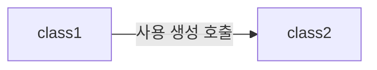
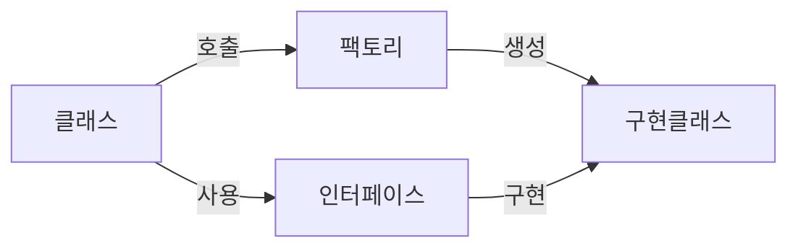
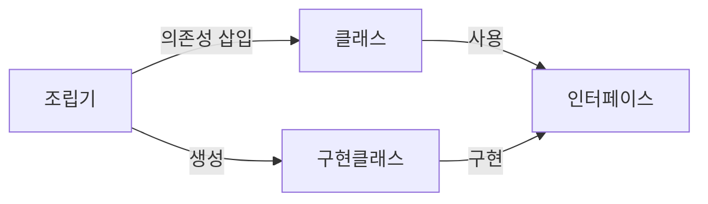
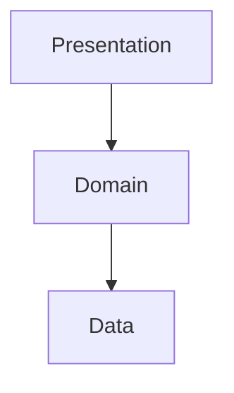

# 4/11

## 레벨2를 슬기롭게 소화하기

- 학습해야하는 내용의 범위가 넓으니, 깊이를 제한한다.
- 얼마까지 해야 할까? -> 프롤로그 참고하기
- 다른 웹 서비스를 유심히 살펴보자. 평소 자주 사용하거나 내가 만드는 것과 비슷한 서비스를 뜯어본다.
- 현재 상태에 따라서 목표를 설정하자. 나는 스프링을 접해본 적이 있지만 얕은 지식을 가지고 있다. 내가 쓰고 있는 기술들을 알고 쓰고 싶다!
- 꾸준함을 잃지 말자.
- 레벨2의 나의 목표는 무엇인가? 내가 쓰는 기술들이 무엇인지, 왜 좋은지, 어떤 점에서는 안 좋을 수 있는지 알고 사용하고 싶다. '알고 쓰자!'가 이번 레벨2의 목표다.
- 왜 스프링을 학습해야할까? 그건 아직 모르겠다... 그냥 자바로 웹 애플리케이션을 만들어보고 싶어서?
- 처음 하는 사람보다는 이미 알고 있는 사람이 동작 원리에 대해서 학습했으면 좋겠다.

# 4/14

## Spring MVC

### `@RestController` vs `@Controller`

- `@RestController` 는 `@ResponseBody`를 포함하는 것으로, 그냥 객체를 리턴해도 `@ResponseBody` 를 한 것과 동일하다.
- `@Controller` 에서 String을 리턴하면 view 파일을 찾는다. `@RestController` 는 String을 리턴하면 `@ResponseBody` 로 감싸진 String 이 리턴된다.

### `@ResponseEntity`

status와 header를 포함한다. status를 설정해줄 수 있다.
컨벤션을 통일하는 것이 좋다.
내 생각: 차라리 모든 응답에 `ResponseEntity`로 감싸는 게 나을 것 같다. (status 설정하고 쓰는 것)

`ResponseEntity` raw type으로 사용하지 말자.

## Spring JDBC

connection을 열고 닫는 과정이 필요 없다.
나는 간단하게 쿼리만 작성하면 되어서, 도메인 로직에만 집중할 수 있다.

`JdbcTemplate`, `NamedParameterJdbcTemplate`, `SimpleJdbcInsert` 를 사용하는 기준을 잡으면 좋겠다. DB에 조회에 그치지 말고, 해당 template 들의 차이점을 알고 썼으면 좋겠다.

# 4/18

## 의존성



### 객체 내부에서 객체를 생성하고, 사용한다면

협력의 문맥이 고정된다.
사용하는 객체가 변경되었을 때 변경이 필요하게 된다. 




다음과 같은 코드가 된다.

```java
public RacingCarService(PlayerResultDao playerResultDao) {
	this.playResultDao = playerResultDao;
}
```

이런 역할을 Spring이 해준다.

Spring IoC Container는 의존성을 주입하는 방식으로 객체를 생성, 관리한다. 객체 간의 연결 관계, 의존성을 관리해준다.

Spring이 모든 객체를 관리하는 것은 아니다. 개발자가 설정한 특정 객체들만 관리한다.

## 설정의 방식

1. XML
2. Annotation-based configuration
3. Java-based configuration

`@Service`, `@Component`, `@Repository` ... 등등
Service, Repository가 아니지만 Bean으로 설정하기 위해 `@Component` 를 사용할 수 있다.

`@Service`, `@Controller`, `@Repository` 는 모두 `@Component` 를 포함한다. 
위의 어노테이션은 해당 클래스를 Spring bean으로 만들라는 뜻이다.

`@ComponentScan` 어노테이션을 통해 등록할 빈을 스캔할 classpath를 지정한다.
`@SpringBootApplication` 의 내부에 `@ComponentScan` 이라는 어노테이션이 존재해서, 자동으로 bean을 생성할 수 있다.

# 4/21

## 계층화

이번 미션 때 Console 기반의 애플리케이션을 Web에서도 제공하는 프로그램을 작성했다.
Console과 Web의 비즈니스 로직과 데이터 로직은 어느정도 중복되는 부분이 있다. 
중복 로직을 `Service` 라는 것으로 분리하게 되면, `RacingCarDao` 가 추상화된다.
-> 자연스럽게 계층이 나눠지게 된다. 이전부터 사용한 보편적인 구조이다.



관심사를 분리(단일 책임 원칙)해서 계층이 나눠지게 된다. 변경이 잘 되지 않는 도메인 로직을 보호하기 위해 계층화를 사용하게 된다. 변경으로부터 보호하기 위해 단방향으로 진행한다. 

## Validation

검증해야 할 입력 값이 존재한다. 그렇다면 입력 값의 검증은 어떤 계층에서 확인해야할까?
사람마다 규칙은 다를 수 있다.

## 스프링을 사용하지 않는 환경을 고려해야 할까?

브리: 프레임워크의 큰 변동이 있는 경우에는 보통 다시 만든다. 그래서 그 부분은 큰 문제가 되지 않는다고 생각한다.

솔라: 현업에서는 같은 기능을 하는데 아예 새로운 프로그래밍 언어로 하도록 변경하거나, 아예 새로운 웹 프레임워크를 쓸 정도의 작업은 ‘리팩토링’ 보다는 ’porting’ 에 해당하는 작업으로 정의합니다. 보통 포팅에서는 기존 코드를 최대한 재활용하는 이점보다 새로운 언어나, 프레임워크를 선택하는 이점이 더 크다고 판단해 선택하는 경우가 많아서, 기존코드의 언어적, 프레임워크적 특징이 담긴 코드를 못 가져가는 것은 당연히 감수해야하는 것으로 생각하긴 했습니다.

=> 나의 결론: 스프링 프레임워크 열심히 활용하자!